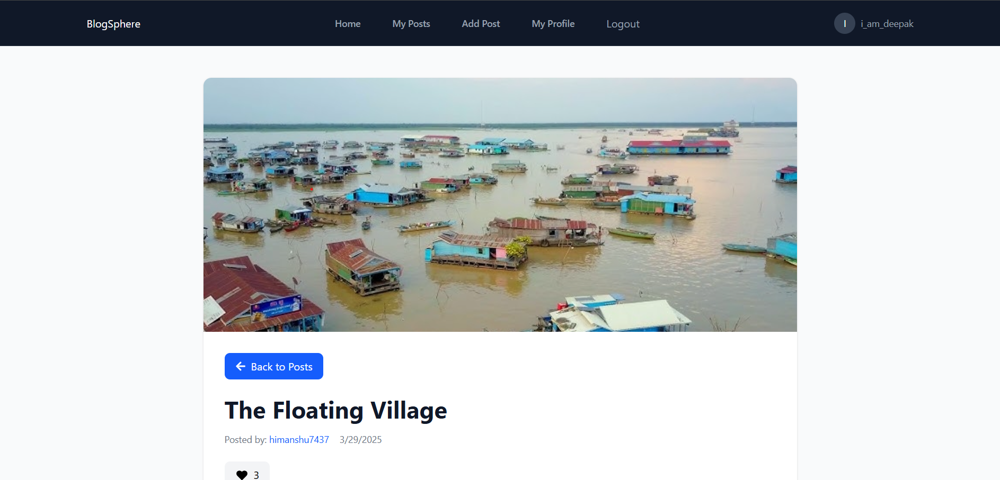
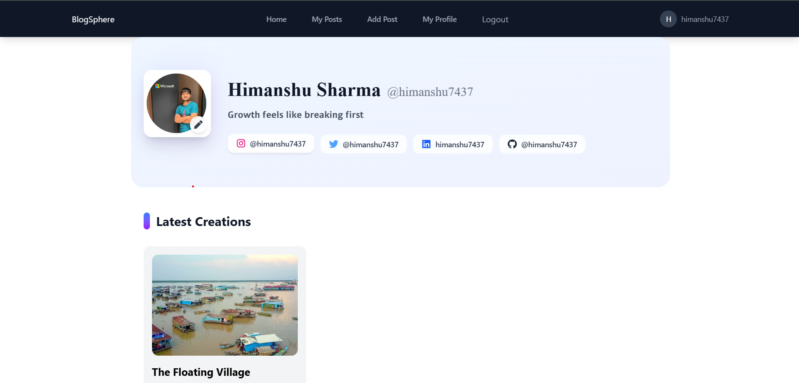

# BlogSphere 📝  

BlogSphere is a modern and fully functional **blogging website** built with **React.js** and powered by **Appwrite** for backend services. This platform allows users to **create, edit, delete, and like blog posts** while providing a **comments section** for discussions.  

🔹 **Authenticated users** can create posts, like posts, and add comments.  
🔹 **Non-logged-in users** can **view** blog posts but **cannot interact** (like or comment).  

## 🚀 Features  

✅ **User Authentication** – Secure login and signup using Appwrite authentication.  
✅ **Create, Edit & Delete Posts** – Users can manage their own blog posts.  
✅ **View Posts** – Anyone (logged in or not) can view blog posts.  
✅ **Like Feature** – Logged-in users can like blog posts.  
✅ **Comments System** –  
   - Logged-in users can **add, edit, or delete** their comments.  

✅ **User Profiles** – Each user has a profile that displays their posts and details.  
✅ **Responsive UI** – The website is fully responsive across different screen sizes.  

---

## 🛠️ Tech Stack  

### **Frontend**  
- **React.js** – For building the UI.  
- **Redux** – For managing global state.  
- **Tailwind CSS** – For styling the UI.  
- **React Icons** – For adding icons.  
- **React Router** – For navigation.  

### **Backend (Appwrite Services)**  
- **Authentication** – Handles user login/signup.  
- **Database** – Stores posts, comments, likes, and user profiles.  
- **Storage** – Hosts images and featured post thumbnails.  
- **Appwrite Functions** – Manages server-side logic when required.  

---

## 📂 Project Structure  

```
blogwebsite/
│── public/               # Static assets
│── src/
│   ├── appwrite/         # Appwrite service configurations
│   ├── components/       # Reusable UI components (Buttons, Loader, LikeButton, etc.)
│   ├── pages/            # Main pages (Home, Post, Profile, Login, etc.)
│   ├── store/            # Redux state management files
│   ├── conf/             # managing Environment variables
│   ├── App.jsx             # Main application component
│   ├── main.jsx           # Entry point of the application
│── .env                   # Environment variables (Appwrite keys)
│── package.json           # Project dependencies
│── README.md              # Project documentation
```

---

## 🖥️ Installation & Setup  

### **1. Clone the Repository**  
```bash
git clone https://github.com/himanshu7437/blogwebsite.git
cd blogwebsite
```

### **2. Install Dependencies**  
```bash
npm install
```

### **3. Setup Environment Variables**  
Create a `.env` file in the root directory and add your **Appwrite credentials**:  
```plaintext
VITE_APPWRITE_URL=""
VITE_APPWRITE_PROJECT_ID=""
VITE_APPWRITE_DATABASE_ID=""
VITE_APPWRITE_COLLECTION_ID=""
VITE_APPWRITE_PROFILE_COLLECTION_ID=""
VITE_APPWRITE_LIKES_COLLECTION_ID=""
VITE_APPWRITE_COMMENTS_COLLECTION_ID=""
VITE_APPWRITE_BUCKET_ID=""
VITE_APPWRITE_AVATARS_BUCKET_ID=""
VITE_APPWRITE_DEFAULT_AVATAR=""
VITE_TINYMCE=""
```

### **4. Start the Development Server**  
```bash
npm run dev
```
Your blog website should now be running at `http://localhost:3000/`.

---

## 🔑 Authentication & User Roles  

| Feature           | Logged-in Users | Non-logged-in Users |
|------------------|----------------|---------------------|
| View Posts       | ✅ Yes          | ✅ Yes             |
| Create Post     | ✅ Yes          | ❌ No              |
| Edit/Delete Post | ✅ Yes (own)    | ❌ No              |
| Like Posts      | ✅ Yes          | ❌ No              |
| View Comments   | ✅ Yes          | ❌ No             |
| Add Comments    | ✅ Yes          | ❌ No              |

---

## 📸 Screenshots  

### **Home Page**  
  

### **Post Page**  
  

### **Profile Page**  
  


---

## 🧑‍💻 Contributors  
👤 **Your Name** – [GitHub Profile](https://github.com/himanshu7437)  

---

## 🎯 License  
This project is **open-source** and available under the **MIT License**.  

---

### 🚀 **Enjoy Blogging with BlogSphere!** 🎉